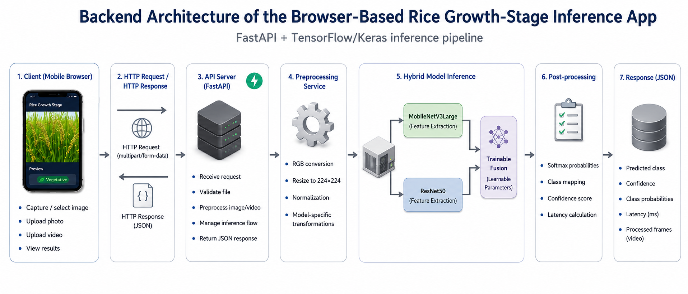
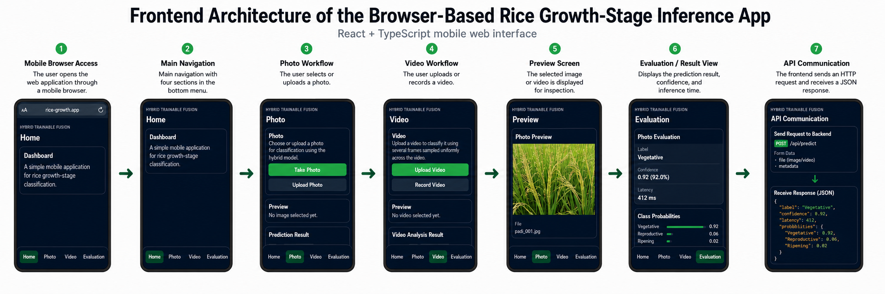

<div align="center">

# 🌾 Rice Growth-Stage Classifier

**A browser-based full-stack app that classifies the growth stage of rice plants from a photo or video, powered by a Hybrid MobileNetV3 + ResNet50 fusion model.**

[](https://www.python.org/)
[](https://fastapi.tiangolo.com/)
[](https://www.tensorflow.org/)
[](https://react.dev/)
[](https://www.typescriptlang.org/)
[](https://huggingface.co/eranusadata/rice-growth-hybrid-fusion-model)

</div>

---

## 📖 Overview

This app takes a photo or short video of a rice plant and classifies it into one of **4 growth stages**:

| Stage | Indonesian label |
|---|---|
| 🌱 Early Vegetative | `vegetatif_awal` |
| 🌿 Late Vegetative | `vegetatif_akhir` |
| 🌾 Generative | `generatif` |
| 🌾 Harvest | `panen` |

Predictions are served by a **Hybrid Trainable Fusion** model — two backbones (**MobileNetV3Large** + **ResNet50**) whose features are combined through a small learnable fusion layer — trained as part of a thesis on rice growth-stage classification.

## 🏗️ Architecture

<div align="center">

**Backend — FastAPI + TensorFlow/Keras inference pipeline**



**Frontend — React + TypeScript mobile web interface**



</div>

## ✨ Features

- 📸 **Photo classification** — upload or capture a photo, get an instant prediction
- 🎥 **Video classification** — upload/record a video, classified from sampled frames
- 📊 **Full result detail** — predicted class, confidence, per-class probabilities, and inference latency
- ☁️ **Cloud-friendly model loading** — the 233 MB model is fetched automatically from [Hugging Face Hub](https://huggingface.co/eranusadata/rice-growth-hybrid-fusion-model) at startup, so this repo itself stays lightweight
- 🖥️ **One-command local launch** — a single script sets up and runs both backend and frontend

## 🧰 Tech stack

| Layer | Stack |
|---|---|
| Model | TensorFlow / Keras — MobileNetV3Large + ResNet50 hybrid trainable fusion |
| Backend | FastAPI, Uvicorn, Pillow, OpenCV, Hugging Face Hub |
| Frontend | React 18, TypeScript, Vite |
| Model hosting | Hugging Face Hub (downloaded automatically at backend startup) |

## 🚀 Quick start (local)

**Prerequisites:** [Python 3.10+](https://www.python.org/downloads/) and [Node.js LTS](https://nodejs.org/) installed.

```bash
git clone https://github.com/abdul014/rice-growth-stage-classifier.git
cd rice-growth-stage-classifier
```

Then either double-click **`run_local_fullstack.bat`**, or from the `frontend` folder run:

```bash
npm run dev:full
```

The first run automatically creates a Python virtual environment, installs backend dependencies, runs `npm install` for the frontend, and downloads the model from Hugging Face Hub (a few minutes, one-time only). Every run after that starts in seconds.

Once both servers are up, open **http://localhost:5173**.

Manual setup, if you'd rather run each side yourself:

```bash
# Backend
cd backend
python -m venv .venv
.venv\Scripts\activate          # Windows
pip install -r requirements.txt
uvicorn app.main:app --reload --port 8000

# Frontend (separate terminal)
cd frontend
npm install
npm run dev
```

## 🔌 API reference

| Method | Endpoint | Description |
|---|---|---|
| `GET` | `/` | Health check |
| `GET` | `/health` | Health check |
| `POST` | `/predict/photo` | Classify a single photo (`multipart/form-data`, field `file`) |
| `POST` | `/predict/video` | Classify a video (samples up to 24 frames) |

Interactive docs available at `http://localhost:8000/docs` once the backend is running.

## 📁 Project structure

```
rice-growth-stage-classifier/
├── backend/
│   ├── app/
│   │   ├── main.py              # FastAPI app + CORS setup
│   │   ├── routes/               # /predict, /health endpoints
│   │   ├── services/              # inference + video sampling logic
│   │   └── schemas/               # request/response models
│   └── requirements.txt
├── frontend/
│   ├── src/
│   │   ├── App.tsx                # Home / Photo / Video / Evaluation tabs
│   │   ├── components/
│   │   ├── features/
│   │   └── services/api.ts        # backend API client
│   └── package.json
├── docs/images/                    # architecture diagrams used in this README
└── run_local_fullstack.bat         # one-command local launcher (Windows)
```

## 🧠 Model

- **Architecture:** Hybrid Trainable Fusion (MobileNetV3Large + ResNet50 backbones, learnable fusion layer)
- **Input:** 224×224 RGB image
- **Classes:** 4 rice growth stages
- **Weights:** hosted on [Hugging Face Hub](https://huggingface.co/eranusadata/rice-growth-hybrid-fusion-model), downloaded automatically by the backend at startup — no need to download it manually

## 📄 License

This project was built as part of an academic thesis on rice growth-stage classification.
